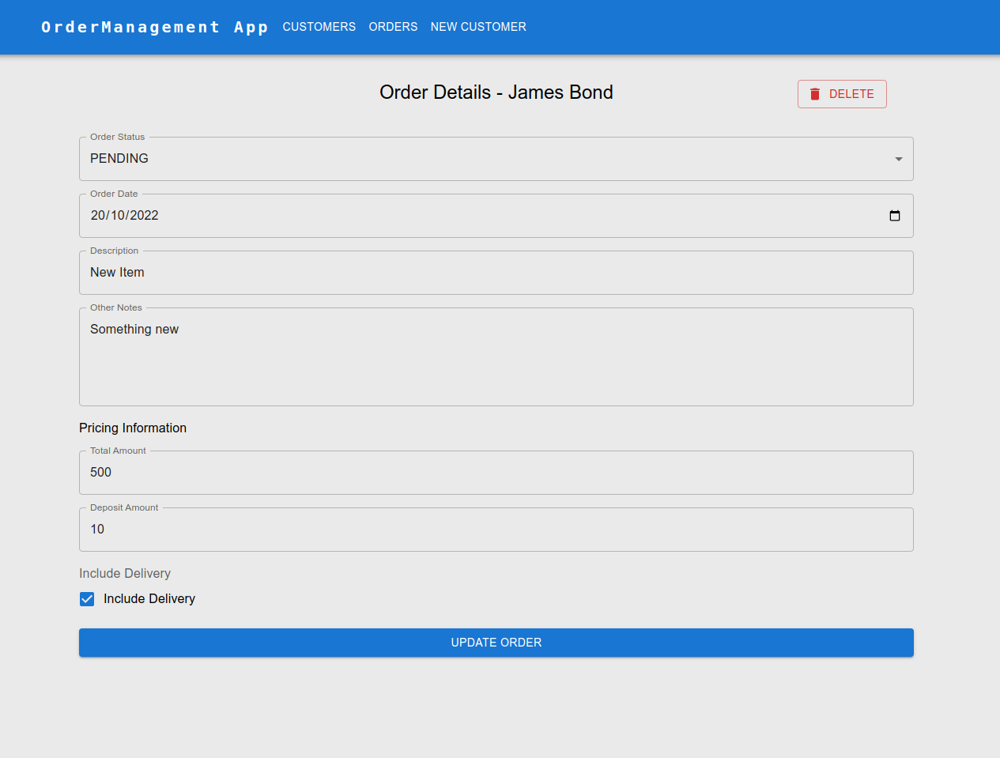
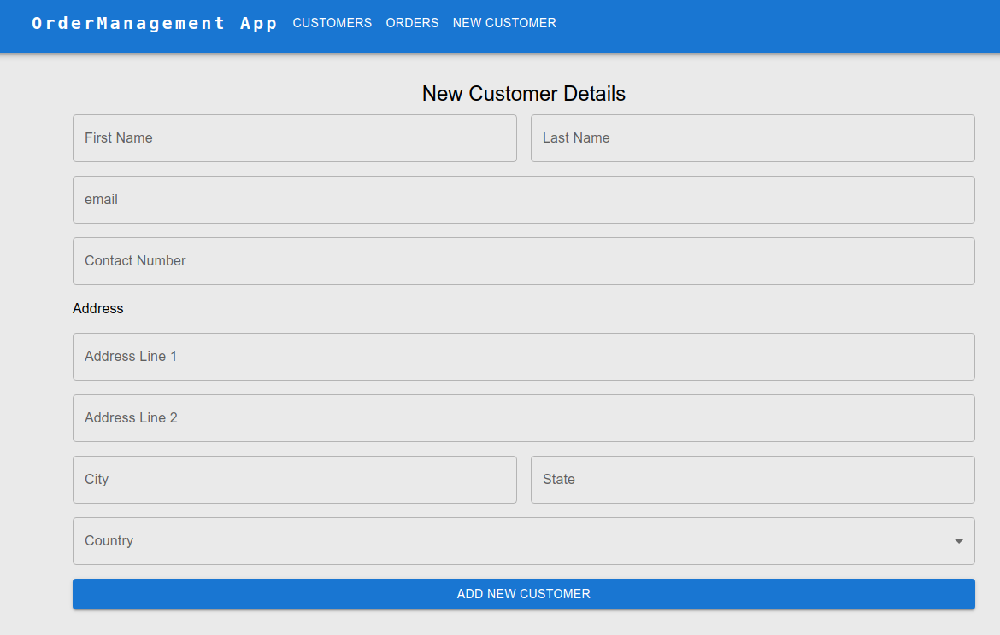

# odmgmt

## run production build with docker

```bash
## clone repo
git clone https://github.com/zizzhangJohn/odmgmt.git

## go into root dir
cd odmgmt

## create .env file for production build
echo "VITE_API_SCHEMA_URL=http://localhost:8080/graphql/" >> ./Frontend/.env.production
## run via docker-compose in detach mode
## npm install may take some time, but it's docker, it will run for sure lol
docker-compose up -d
```
go to `localhost:8080`

## Note
```bash
## to remove stop and remove containers
docker-compose down
```
This command will not remove volume `db-data`, which is persistent storage of database data specified in `docker-compose.yml`. To remove it, run
```bash
docker volume rm <volume-name>
```
Website is not responsive, it only support Desktop, and I don't think it makes sense to support mobile on this kind of app.

I will work on the demo deployment soon.

## Screenshot





